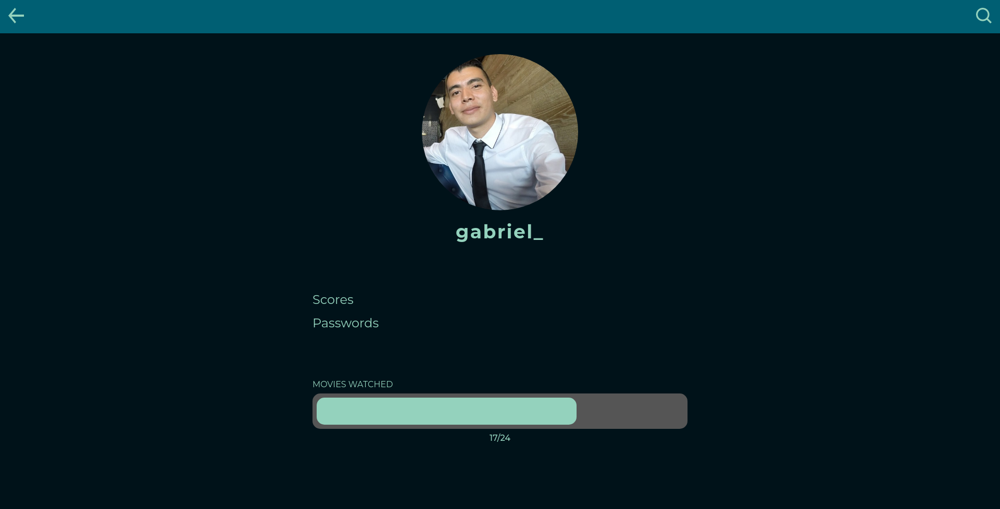

# Frontend Studio Ghibli Tracker

El proyecto de Frontend Studio Ghibli Tracker es un proyecto creado para obtener los datos de películas del Estudio Ghibli, obteniendo la información desde una API creada por el equipo de Backend de nuestra organización, para obtener los datos que necesita nuestra aplicación y mostrarlo con un diseño moderno y con una buena experiencia de usuario para los usuarios finales.

## Despliegue

Nuestros usuarios pueden encontrar la información de las películas del Estudio Ghibli [aquí](https://fe-ghibli-tracker.vercel.app/ "Ghibli Tracker App"), dónde encontraran una manera para gestionar sus películas favoritas del estudio Ghibli.

## Uso de la aplicación

### Iniciar Sesión
1. Ingresar en el siguiente enlace [Inicio de Sesión](https://fe-ghibli-tracker.vercel.app/login).
2. Ingresar la información del correo electrónico y la contraseña con la cuál fue registrado el usuario.
3. Dar click en el botón **Login** para ingresar en la aplicación.

### Registrar usuario
1. Ingresar en el siguiente enlace [Registro de usuario](https://fe-ghibli-tracker.vercel.app/signUp).
2. Ingresar la información del correo electrónico, nombre de usuario y contraseña con la cuál quiere registrar el nuevo usuario.
3. Dar click en el botón **Enviar** para realizar el registro del nuevo usuario.

### Buscar películas
El usuario debe tener iniciada la sesión para ingresar en el módulo de inicio y poder realizar la búsqueda de películas por título.
1. En la barra de navegación superior debe dar click en el icono con forma de lupa.
2. Ingresar el título buscado en el campo de búsqueda.
3. Ver el resultado de las películas encontradas según el filtro realizado.

### Ver información del usuario
El usuario debe tener iniciada la sesión para ingresar en el módulo de inicio y poder ver la información del usuario registrado.
1. En la barra de navegación superior cuando está en la ruta de inicio "https://fe-ghibli-tracker.vercel.app/" debe dar click en el icono con forma de silueta de una persona.
2. Ver la información del usuario:
   1. Imagen de perfíl.
   2. Nombre de usuario.
   3. Puntajes de las películas.
   4. Gestión de la contraseña del usuario.
   5. Cantidad de películas vistas por el usuario.

### Calificar películas
El usuario debe tener iniciada la sesión para ingresar en el módulo de inicio y poder calificar las películas del catálogo.
1. En el inicio de la aplicación el usuario tiene el catálogo de las películas del estudio Ghibli listadas.
2. En cada película el usuario tiene la opción de calificarla por medio de un puntaje de estrellas con escala de 1-5.
3. El usuario tiene la opción de calificar la película dando click en el corazón para que deje un registro si le gusta o no la misma.
